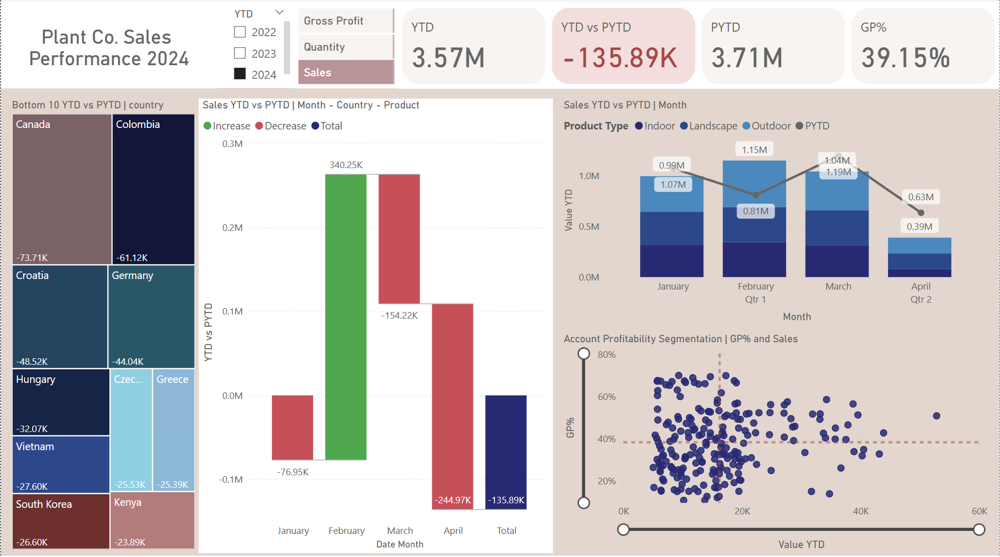

# Plant Co. Sales Performance Dashboard
## Overview  
This project analyzes Plant Co.’s global sales performance from 2022 to 2024 to help stakeholders understand financial trends, profit drivers, and underperforming markets.  
The dashboard enables dynamic exploration of Year-to-Date (YTD) performance, product segmentation, and country-level profitability, supporting data-driven business decisions.

---

## Project Goals  
- Provide executives with interactive insights into sales, quantity, and gross profit.  
- Track YTD versus Previous Year-to-Date (PYTD) performance to identify growth or decline trends.  
- Segment accounts by profitability and product type to uncover optimization opportunities.  
- Deliver a self-service BI report for strategic planning and executive review.

---

## Process  

### 1. Data Preparation  
- Imported and cleaned raw Excel data (`Plant_DTS.xls`) using Power Query.  
- Standardized date formats, managed missing values, and validated data integrity.  

### 2. Data Modeling  
- Designed a star schema with the following tables:  
  - `Fact_Sales`: core transaction data  
  - `Dim_Product`: product families, groups, and sizes  
  - `Dim_Account`: customer and regional attributes  
  - `Dim_Date`: date hierarchy for time intelligence  
- Added calculated columns and measures to support accurate aggregation and time-based comparisons.

### 3. DAX Measures  
Developed key performance measures, including:  
```DAX
Sales = SUM(Fact_Sales[Sales_USD])
GP = [Sales] - [COGS]
YTD_Sales = TOTALYTD([Sales], Fact_Sales[Date_Time])
PYTD_Sales = CALCULATE([Sales], SAMEPERIODLASTYEAR(Dim_Date[Date]))
GP% = DIVIDE([GP], [Sales])
YTD_vs_PYTD = [YTD_Sales] - [PYTD_Sales]
```
Dynamic SWITCH statements were also implemented to toggle between Sales, Quantity, and Gross Profit views.

### 4. Visualization Design  
- Built interactive visuals including Tree Maps, Waterfall Charts, Stacked Bar-Line Charts, and Scatter Plots.  
- Applied consistent color themes and conditional formatting for better readability.  
- Included slicers for dynamic filtering by year, country, and product type.  

### 5. Deployment  
- Created using Power BI Desktop (Free version).  
- The final report is designed for publishing in Power BI Pro for sharing and collaboration.

---

## Key Insights  
1. Canada recorded the sharpest decline across Sales, Quantity, and Gross Profit.  
2. Outdoor products outperformed Indoor and Landscape categories by approximately $127K year-over-year.  
3. March and April 2024 were the weakest months, driven mainly by Indoor product decline.  
4. Top customer accounts—Kunze, Will, and Wiegand—achieved over 50% Gross Profit.  
5. Overall YTD sales reached $3.57M, slightly below $3.71M PYTD (-3.7%).

---

## Data Model  
The model follows a star schema structure linking fact and dimension tables through unique IDs.  


---

## Dashboard Preview  


---

## Tools and Technologies  
| Tool | Purpose |
|------|----------|
| Power BI Desktop | Data modeling and visualization |
| Power Query (M) | ETL and data transformation |
| DAX | KPI and time-intelligence calculations |
| Microsoft Excel | Source data file |
| GitHub | Version control and portfolio hosting |

---
## Author  
**Trongsorn (Tammy) Yangyuen**  
Brisbane, Australia  
Email: [trongsorn.yan@gmail.com](mailto:trongsorn.yan@gmail.com)  
LinkedIn: [linkedin.com/in/trongsornyan](https://www.linkedin.com/in/trongsornyan/)  
Portfolio: [tammy-portfolio.notion.site]([https://tammy-portfolio.notion.site](https://tammy-portfolio.notion.site/TAMMY-S-DATA-PORTFOLIO-19833cc1e32c80f6a884c93f6b0cd311))


